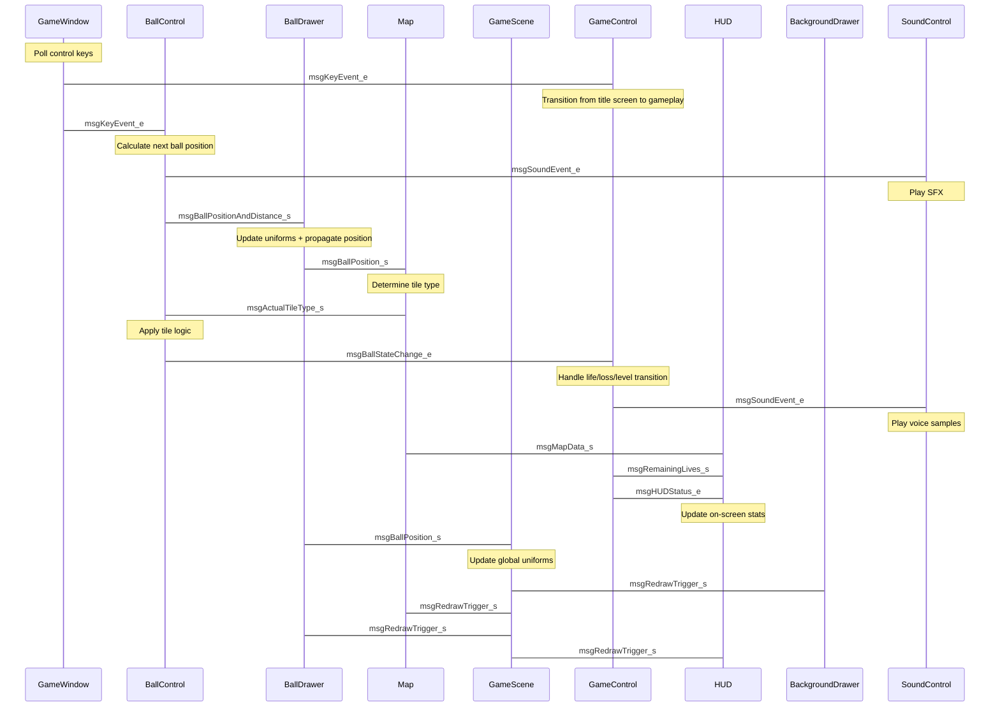

Below is a polished, professional, and GitHub-friendly version of your README.
I focused on clarity, structure, readability, and presentation while keeping all technical details intact.
Feel free to ask if you'd like badges, installation GIFs, logos, or a shorter/longer version.

---

# **TrailBlazeR — Modern OpenGL Remake of the 1986 Classic**

TrailBlazeR is a modern OpenGL-based remake of one of my favorite childhood games originally released in 1986 for 8-bit computers such as the Commodore and Amiga systems.
This project started as a hands-on way to learn modern OpenGL and gradually evolved into a multimedia experience—featuring custom tools, reusable components, AI-generated backgrounds, and original music.

<div align="center">
  
</div>

---

## 🎯 **Raison d'être**

As a software developer with 10+ years of experience (mainly computer vision and embedded systems), I wanted to dive into something completely different.
Learning OpenGL in the context of a fully functional game turned out to be the perfect playground—combining:

* modern C++ abstractions
* real-time rendering
* physics
* audio design
* reusable software architecture

What began as a “learn OpenGL” side project eventually grew into a passion project that blends game development, audio design, and reusable open-source components.

---

# 🚀 **Features**

* Guide a rolling ball through **10 levels** suspended above planets of the Solar System
* **Custom map format** with tooling for editing or generating levels
* AI-generated sci-fi background artworks (via NightCafé)
* Original, self-composed soundtrack recorded using my experimental/ambient project
* Custom analog-synth-recorded sound effects
* Built using modern OpenGL (core profile) and clean C++20 abstractions
* Highly modular design with reusable components (GLKit, messaging, state machine, rigid body physics)

---

# ⚡ Quick Start

If you just want to try the game:

📦 **Download the Windows x64 builds from the Releases page**
The game was developed on Ubuntu 20.04, but Windows binaries are available for convenience.

---

# 🛠️ Building From Source

### **Dependencies**

You’ll need:

* **GLFW3**
* **GLM**
* **libPNG**
* **SFML** (audio + system)
* **GLAD** (included in repo)

### **Building**

The project uses **CMake**.

Tested with **GCC 9.4.0**, but any C++20-compliant compiler should work.
On Windows, you may need to rely on Homebrew/MSYS packages.

```bash
mkdir build
cd build
cmake ..
make -j
```

---

# 🎮 Game Instructions

* Move Left/Right → **Arrow Keys** or **A / D**
* Jump → **SPACE** or **Left CTRL**

Tile Types:

* **Light Green** → Speed up (enables longer jumps)
* **Light Red** → Slow down to base speed

Clearing a stage grants **one extra life**.

---

# 🔧 Reusable Components

This project contains several standalone C++ components licensed under **The Unlicense**.
They can be freely reused in any project.

---

## 🎨 **GLKit — Modern C++ OpenGL Wrapper**

A modular, type-safe wrapper around OpenGL, designed for RAII correctness and ease of use.

Located in: `include/glkit/core`

### Modules:

#### **buffers/**

RAII wrappers for **VAOs**, **VBOs**, and **EBOs**.

#### **shaders/**

Compile, link, and manage shader programs (supports geometry + tessellation).

#### **uniforms/**

Type-safe uniform handling using C++20 templates and lambdas.

> GLKit uses **GLAD bindings**, shipped with this repository.

---

## 🔄 **State Machine (single-header)**

A minimal, elegant state-machine API created to replace complex nested `if`-chains inside the game's logic.

Key features:

* Explicit state transitions
* Predicate-based activation
* Optional “on transition” and “on fail” callbacks
* Only valid transitions are allowed via the public API
* Greatly simplifies state-heavy gameplay logic

The game’s entire state management is now expressed as **11 calls to `addTransition()`**.

---

## 📬 **Messaging System — Observer Pattern with Modern C++**

The messaging component is the backbone of the game loop.
It implements a decoupled, event-driven architecture using templates and `std::any`.

Benefits:

* Zero inter-component coupling
* No cross-class includes
* No direct pointers or references between gameplay systems
* Strong typing for message categories
* Any class can publish or subscribe to messages

Core class: **`PostOffice_c`**

Used to:

* Broadcast messages
* Register recipients
* Orchestrate system-wide event flow

This infrastructure drives everything from input handling to redraw triggers.

---

## 🧬 **Message Flow Diagram**



---

## ⚙️ **Rigid Body Physics**

A tiny, dependency-free physics module located in `rigidbody/`.
Includes:

* `Vector3D_s`
* A lightweight particle-based rigid body simulator

While minimal, it was sufficient for the game's physics.
I’m planning to expand it for future projects.

---

# 🌌 TrailBlazer_Modern_OPENGL_Remake

A modern tribute to a legendary classic, rebuilt using clean, reusable C++20 architecture and real-time OpenGL rendering.

---


